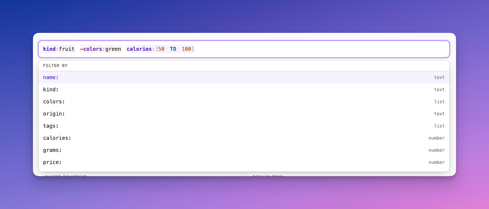

# field-search

A small fielded-query language with parsing, stringifying, tolerant editing
segments, and reusable React search-input primitives.

`field-search` handles the query language and editing experience. Your
application decides how the resulting AST maps to a database query, API
request, or in-memory filter.



Try it in the [live playground](https://heron--.github.io/field-search/).

## Install

```sh
npm install field-search react react-dom
```

React 18.2 and 19 are supported.

## React quick start

Import the component and its complete default appearance, then control it with
`value` and `onValueChange`:

```tsx
import * as React from "react";
import { SearchInput, type SearchContext } from "field-search/react";
import "field-search/styles.css";

const fields = [
  { field: "kind", detail: "Type", values: ["fruit", "vegetable"] },
  { field: "color", detail: "Color", values: ["red", "green", "yellow"] },
  { field: "price", detail: "Number" },
];

export function InventorySearch() {
  const [value, setValue] = React.useState("");

  function runSearch(query: string, context: SearchContext) {
    // context.ast is already parsed. It is null when the valid query is empty.
    console.log({ query, ast: context.ast });
  }

  return (
    <SearchInput
      aria-label="Search inventory"
      name="query"
      placeholder="kind:fruit color:red"
      value={value}
      onValueChange={setValue}
      onSearch={runSearch}
      fields={fields}
    />
  );
}
```

`fields` powers the built-in suggestion matcher. At the start of a new filter,
it suggests field names. After a field and colon, it suggests that field's
`values`. Values containing spaces or parentheses are quoted when inserted.

`SearchInput` forwards its ref to the native input and accepts native input
attributes such as `id`, `name`, `placeholder`, `disabled`, `required`, and
ARIA labeling.

## Query syntax

| Query                                            | Meaning represented in the AST      |
| ------------------------------------------------ | ----------------------------------- |
| `apple`                                          | Bare term                           |
| `kind:fruit`                                     | Field filter                        |
| `name:"granny smith"`                            | Quoted value containing spaces      |
| `name:granny\ smith`                             | Escaped space in an unquoted value  |
| `name:*berry`                                    | Wildcard value                      |
| `-kind:vegetable`                                | Negated filter                      |
| `kind:fruit AND color:red`                       | Boolean AND                         |
| `kind:fruit OR kind:vegetable`                   | Boolean OR                          |
| `(kind:fruit OR kind:vegetable) AND color:green` | Grouped query                       |
| `color:(red OR green)`                           | Boolean expression within one field |
| `color:(red AND -green)`                         | Negated value within a field group  |
| `price:>2`, `price:<=10.5`                       | Numeric comparison                  |
| `price:[2 TO 10]`                                | Numeric range                       |
| `harvested:@2024-01-15`                          | Date or datetime literal            |
| `harvested:[@2024-01-01 TO @2024-12-31]`         | Date or datetime range              |

`AND` binds more tightly than `OR`; parentheses override precedence. Adjacent
expressions are preserved as adjacent AST children so your application can
choose their meaning. Quote or backslash-escape spaces and structural
characters when they are literal content.

## Parse and stringify

Use the framework-independent entry point when you only need the language:

```ts
import { parse, stringify } from "field-search";

const ast = parse("kind:fruit colors:(red OR green) price:<=5");

if (ast.children[0]?.type === "Filter") {
  console.log(ast.children[0].field); // "kind"
}

stringify(ast); // reproduces the original query
```

`parse` throws a `ParseError` for malformed or empty input. The React APIs use
tolerant editing state instead, because an in-progress query such as `kind:`
must remain editable.

You can also construct a typed AST and stringify it:

```ts
import { exact, filter, query, stringify, term } from "field-search";

const ast = query([filter("kind", term(exact("fruit")))]);

stringify(ast); // "kind:fruit"
```

## Drafts and searches

`onValueChange` reports every edit, including incomplete drafts. `onSearch`
only receives a valid `SearchContext`; use it to update results or send a
request to your backend.

```tsx
const [draft, setDraft] = React.useState("");
const [submitted, setSubmitted] = React.useState("");

<SearchInput
  aria-label="Search"
  value={draft}
  onValueChange={setDraft}
  onSearch={(value, context) => {
    setSubmitted(value);
    searchWithAst(context.ast); // QueryNode | null
  }}
/>;
```

A valid draft is committed when the user presses Enter or leaves the input.
Completing or removing a chip also commits by default. Set `searchOnBlur`,
`searchOnChipComplete`, or `searchOnRemove` to `false` to disable the
corresponding boundary. An empty query is valid and has `context.ast === null`,
which makes it useful for clearing a search. Incomplete or malformed drafts
have `context.valid === false` and are never passed to `onSearch`.

Standalone `and` and `or` tokens are normalized to `AND` and `OR` when a
separator completes them, including inside grouped values. This lets field
names such as `origin` remain lowercase while they are being typed. Quoted text
and ordinary values such as `name:and` are left unchanged.

## Asynchronous suggestions

For server-provided options, capture the caret context and supply a controlled
`suggestions` array. When `suggestions` is present, it replaces the built-in
`fields` matcher. The
[live playground](https://heron--.github.io/field-search/) includes a working
version: the main search loads `origin` values from a displayed, locally
mocked, cancellable country source and uses the accepted value to filter the
results table.

```tsx
import * as React from "react";
import {
  SearchInput,
  type SearchContext,
  type SuggestionItem,
} from "field-search/react";

export function AsyncSearch() {
  const [value, setValue] = React.useState("");
  const [context, setContext] = React.useState<SearchContext | null>(null);
  const [suggestions, setSuggestions] = React.useState<SuggestionItem[]>([]);
  const [loading, setLoading] = React.useState(false);

  React.useEffect(() => {
    if (!context) return;

    const request = new AbortController();
    const params = new URLSearchParams({
      kind: context.target.kind,
      field: context.target.field ?? "",
      q: context.target.fragment,
    });

    setLoading(true);
    fetch(`/api/search-suggestions?${params}`, { signal: request.signal })
      .then((response) => response.json())
      .then((items: SuggestionItem[]) => setSuggestions(items))
      .catch((error: unknown) => {
        if (!(error instanceof DOMException && error.name === "AbortError")) {
          console.error(error);
        }
      })
      .finally(() => {
        if (!request.signal.aborted) setLoading(false);
      });

    return () => request.abort();
  }, [context?.target.kind, context?.target.field, context?.target.fragment]);

  return (
    <SearchInput
      aria-label="Search"
      value={value}
      onValueChange={setValue}
      onContextChange={setContext}
      suggestions={suggestions}
      suggestionsLoading={loading}
      loadingMessage="Loading…"
      emptyMessage="No matches"
    />
  );
}
```

Each suggestion has this shape:

```ts
interface SuggestionItem {
  id?: string;
  label: React.ReactNode;
  detail?: React.ReactNode;
  insert: string;
  disabled?: boolean;
}
```

`insert` is the exact text spliced into the query. Quote or escape it if the
value contains syntax characters. When an accepted value completes the final
chip, `SearchInput` adds a trailing space so the user can continue with the
next filter. Field suggestions such as `origin:` do not add a space.

## `SearchInput` props

`SearchInputProps` extends native `input` attributes except `children`,
`className`, `defaultValue`, `onChange`, `style`, and `value`, which have
component-specific equivalents below.

### Value and events

| Prop                 | Type                       | Default  | Description                                                        |
| -------------------- | -------------------------- | -------- | ------------------------------------------------------------------ |
| `value`              | `string`                   | required | Controlled query string.                                           |
| `onValueChange`      | `(value, context) => void` | required | Called for every query edit.                                       |
| `onSearch`           | `(value, context) => void` | —        | Called at enabled commit boundaries when the query is valid.       |
| `onContextChange`    | `(context) => void`        | —        | Called when editing context changes, including caret-only changes. |
| `onSuggestionSelect` | `(item, index) => void`    | —        | Called after a suggestion is accepted.                             |
| `onSegmentRemove`    | `(segment, index) => void` | —        | Called after a chip is removed.                                    |

`SearchContext` contains `caret`, `target`, `ast`, `error`, `segments`, and
`valid`. `target` identifies the field or value fragment at the caret and is
designed for suggestion requests.

### Suggestions

| Prop                 | Type                                     | Default                  | Description                                                    |
| -------------------- | ---------------------------------------- | ------------------------ | -------------------------------------------------------------- |
| `fields`             | `FieldSuggestion[]`                      | `[]`                     | Fields and values used by the built-in matcher.                |
| `suggestions`        | `SuggestionItem[]`                       | —                        | Controlled suggestions; overrides `fields`.                    |
| `suggestionsHeader`  | `ReactNode \| (context) => ReactNode`    | Contextual label         | Content above the list.                                        |
| `suggestionsLoading` | `boolean`                                | `false`                  | Shows the loading state and sets `aria-busy`.                  |
| `loadingMessage`     | `ReactNode`                              | `"Loading suggestions…"` | Loading-state content.                                         |
| `emptyMessage`       | `ReactNode`                              | —                        | Content shown when no suggestions match.                       |
| `renderSuggestion`   | `(item, { index, active }) => ReactNode` | —                        | Replaces the contents of each suggestion.                      |
| `acceptOnTab`        | `boolean`                                | `false`                  | Lets Tab accept the active suggestion instead of moving focus. |

`FieldSuggestion` is `{ field: string; detail?: ReactNode; values?: string[] }`.

### Search behavior and errors

| Prop                   | Type                   | Default       | Description                                                     |
| ---------------------- | ---------------------- | ------------- | --------------------------------------------------------------- |
| `searchOnBlur`         | `boolean`              | `true`        | Commits a valid draft when focus leaves the component.          |
| `searchOnChipComplete` | `boolean`              | `true`        | Commits after a suggestion or separator completes a valid chip. |
| `searchOnRemove`       | `boolean`              | `true`        | Commits the remaining valid query after chip removal.           |
| `showError`            | `boolean`              | `true`        | Shows parse errors after the input loses focus.                 |
| `renderError`          | `(error) => ReactNode` | Error message | Custom error content.                                           |

### Rendering and styling

| Prop                   | Type                                                  | Default                                             | Description                                                                                                 |
| ---------------------- | ----------------------------------------------------- | --------------------------------------------------- | ----------------------------------------------------------------------------------------------------------- |
| `className`            | `string`                                              | —                                                   | Class on the component root.                                                                                |
| `style`                | `CSSProperties`                                       | —                                                   | Inline styles on the component root.                                                                        |
| `classNames`           | `SearchInputClassNames`                               | `{}`                                                | Classes for root, field, layer, input, chip, close, operator, paren, popover, suggestions, and error parts. |
| `chipClassNames`       | `ChipClassNames`                                      | —                                                   | Classes for content within every chip.                                                                      |
| `suggestionClassNames` | `SuggestionClassNames`                                | —                                                   | Classes for content within the suggestion list.                                                             |
| `renderChip`           | `(segment, { index, hovered, invalid }) => ReactNode` | —                                                   | Replaces a chip's contents.                                                                                 |
| `slots`                | `SearchInputSlots`                                    | `div` elements                                      | Replaces the root, field, layer, or error element type.                                                     |
| `rootProps`            | `HTMLAttributes<HTMLDivElement>`                      | —                                                   | Additional root attributes.                                                                                 |
| `errorProps`           | `HTMLAttributes<HTMLDivElement>`                      | —                                                   | Additional error attributes.                                                                                |
| `popoverProps`         | Radix `Popover.Content` props                         | `{ side: "bottom", align: "start", sideOffset: 6 }` | Controls popover placement and behavior.                                                                    |
| `portalContainer`      | `HTMLElement \| null`                                 | Component root                                      | Portal destination; the root preserves scoped theme variables.                                              |

## Headless composition

`useFieldSearch` provides parsing state, context, suggestions, and editing
operations without rendering markup or loading CSS:

```tsx
import * as React from "react";
import { useFieldSearch } from "field-search/react";

function HeadlessSearch() {
  const [value, setValue] = React.useState("");
  const search = useFieldSearch({
    value,
    onValueChange: setValue,
    fields: [{ field: "kind", values: ["fruit", "vegetable"] }],
  });

  return (
    <div>
      <input
        value={value}
        onChange={(event) =>
          search.commit(
            event.currentTarget.value,
            event.currentTarget.selectionStart ?? 0,
          )
        }
        onSelect={(event) =>
          search.setCaret(event.currentTarget.selectionStart ?? 0)
        }
      />
      {search.items.map((item) => (
        <button
          type="button"
          key={item.id ?? item.insert}
          onClick={() => search.accept(item)}
        >
          {item.label}
        </button>
      ))}
    </div>
  );
}
```

### `useFieldSearch` options

| Option            | Type                       | Default  | Description                                 |
| ----------------- | -------------------------- | -------- | ------------------------------------------- |
| `value`           | `string`                   | required | Controlled query string.                    |
| `onValueChange`   | `(value, context) => void` | required | Receives mutations made by the controller.  |
| `fields`          | `FieldSuggestion[]`        | `[]`     | Source for built-in suggestions.            |
| `suggestions`     | `SuggestionItem[]`         | —        | Controlled suggestions; overrides `fields`. |
| `onContextChange` | `(context) => void`        | —        | Called for query and caret context changes. |

The returned `FieldSearchController` exposes `caret`, `context`, `segments`,
`items`, `validation`, `activeIndex`, `setActiveIndex`, `setCaret`, `commit`,
`accept`, `removeSegment`, and `pendingCaretRef`.

## Presentational primitives

`Chip` and `Suggestions` are ref-forwarding, controlled primitives used by
`SearchInput`. They are available when you want the library's rendering
without its complete composition.

### `Chip` props

`ChipProps` extends native `span` attributes.

| Prop         | Type             | Default  | Description                                                                 |
| ------------ | ---------------- | -------- | --------------------------------------------------------------------------- |
| `segment`    | `Segment`        | required | Chip segment to render.                                                     |
| `hovered`    | `boolean`        | `false`  | Enables the hovered data state.                                             |
| `showError`  | `boolean`        | `true`   | Enables the invalid data state and error title.                             |
| `classNames` | `ChipClassNames` | `{}`     | Classes for negate, field, punctuation, operator, string, and number parts. |

Pass `children` to replace the default highlighted chip contents.

### `Suggestions` props

`SuggestionsProps` extends native `div` attributes except `onSelect`.

| Prop                  | Type                                     | Default                  | Description                                                |
| --------------------- | ---------------------------------------- | ------------------------ | ---------------------------------------------------------- |
| `items`               | `SuggestionItem[]`                       | required                 | Items in the controlled listbox.                           |
| `activeIndex`         | `number`                                 | required                 | Index of the active item.                                  |
| `onSelect`            | `(item, index) => void`                  | required                 | Called when an enabled item is clicked.                    |
| `onActiveIndexChange` | `(index) => void`                        | required                 | Called when pointer movement changes the active item.      |
| `header`              | `ReactNode`                              | —                        | Content above the listbox.                                 |
| `loading`             | `boolean`                                | `false`                  | Shows loading content instead of items.                    |
| `loadingMessage`      | `ReactNode`                              | `"Loading suggestions…"` | Loading-state content.                                     |
| `emptyMessage`        | `ReactNode`                              | —                        | Content shown for an empty list.                           |
| `classNames`          | `SuggestionClassNames`                   | `{}`                     | Classes for header, item, label, detail, and status parts. |
| `getItemId`           | `(item, index) => string`                | —                        | Generates option IDs for combobox relationships.           |
| `renderItem`          | `(item, { index, active }) => ReactNode` | —                        | Replaces each item's contents.                             |

## Styling

The default theme is optional:

```ts
// Structural rules plus the default theme
import "field-search/styles.css";

// Structural rules only; add your own visual rules
import "field-search/base.css";
```

Library rules live in `field-search.base` and `field-search.theme` cascade
layers and use `:where()` selectors, so ordinary consumer CSS wins. Stable
`data-slot` attributes and `classNames` hooks are available for each component
part.

Theme the input by setting custom properties on its root or a wrapper:

```css
.inventory-search {
  --fs-bg: #0f172a;
  --fs-fg: #e2e8f0;
  --fs-border: #334155;
  --fs-focus: #818cf8;
  --fs-chip-bg: #1e293b;
  --fs-chip-fg: #a5b4fc;
  --fs-chip-neg-bg: #3f1d2e;
  --fs-chip-neg-fg: #fca5a5;
  --fs-invalid: #f87171;
}
```

`layout.css` remains as a compatibility alias for `base.css`.

## Development

```sh
npm test
npm run typecheck
npm run build
```

For visual checks, run `npm run dev -- --port 5190` and then `npm run visual`.
The harness writes interaction-state screenshots to `/tmp/fs-shots`.

## License

MIT
